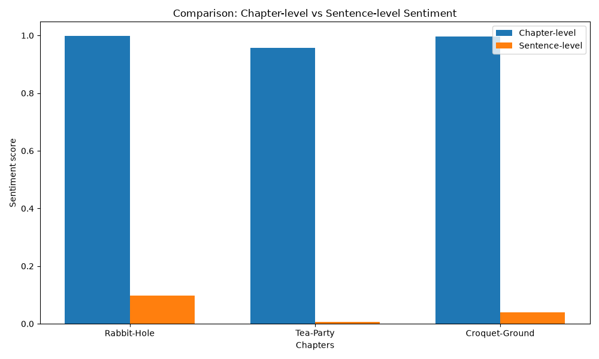

## Sentence‑Level Sentiment Analysis of *Alice’s Adventures in Wonderland*

### A comparison between chapter‑level and sentence‑level VADER results

---

This project extends my earlier sentiment analysis of *Alice’s Adventures in Wonderland* by shifting from **chapter‑level** to **sentence‑level** evaluation. The goal was to examine whether a finer segmentation produces more balanced and interpretable sentiment patterns when using VADER — a tool originally designed for short, informal online text.

### ✨ Why sentence‑level analysis?

---

In the previous chapter‑level analysis, VADER assigned **unexpectedly strong positive sentiment** to entire chapters. This raised a methodological question:

*Does VADER over‑generalize when applied to long literary segments?*

To explore this, I re‑processed the text at the **sentence level**, allowing sentiment to be evaluated on smaller, more coherent units. This approach captures emotional variation within scenes rather than flattening entire chapters into a single score.

### ⚙️ Pre‑processing challenges

---

During tokenization, the sentence tokenizer misinterpreted **chapter numbers and chapter titles** as standalone sentences. This inflated the sentence count and distorted the sentiment distribution.

To correct this, I removed:

-   *CHAPTER I.*, *CHAPTER VII.*, *CHAPTER VIII.*
-   *Down the Rabbit-Hole*, *A Mad Tea-Party*, *The Queen’s Croquet-Ground* 
    
After cleaning, the text was re‑tokenized, ensuring that only narrative sentences were analyzed.

### 📊 Results

---

**Sentence-level distribution**

| Chapter | Positive | Negative | Neutral | Total Sentences |
|----------|----------|----------|----------|----------|
| *Down the Rabbit-Hole* | 29 | 15 | 17 | 61 |
| *A Mad Tea-Party* | 27 | 28 | 41 | 96 |
| *The Queen’s Croquet-Ground* | 31 | 24 | 24 | 79 |

**Comparison with chapter‑level results**

| Chapter | Chapter‑level VADER (compound) | Sentence‑level pattern | Interpretation |
| --- | --- | --- | --- |
| *Down the Rabbit-Hole* | 0.9977 | Mixed, slightly positive | Sentence-level avoids extreme positivity and reflects tonal variation |
| *A Mad Tea-Party* | 0.9562 | Balanced across all three categories | Captures chaotic, dialogue-heavy emotional shifts |
| *The Queen’s Croquet-Ground* | 0.9970 | Mixed, slightly positive | More realistic distribution than the uniformly positive chapter-level score |

---

The chart compares sentiment scores calculated at the chapter level with those calculated at the sentence level, showing how overall emotional tone shifts across the book:

### 🧠 Interpretation

---

The findings clearly show that:

-   **Sentence‑level analysis produces more balanced sentiment distributions.**
-   **Chapter‑level analysis exaggerates positivity**, likely because VADER averages many neutral or mixed sentences into a single score.
-   **Sentence‑level results align better with the narrative tone**, which is whimsical, unstable, and emotionally varied — not uniformly positive.

In short:

**Sentence‑level sentiment analysis is more appropriate for literary prose when using VADER.**

This supports a broader methodological insight: **granularity matters**, especially when applying tools designed for short online text to longer narrative structures.

**Next steps**

-   Add visualizations (sentence-level sentiment bars or stacked distributions)
-   Compare VADER with transformer-based sentiment models (e.g. BERT or RoBERTa)
-   Expand the literary corpus by including works from other authors and genres
-   Investigate how VADER handles irony, sarcasm, and absurd humor in literary texts
